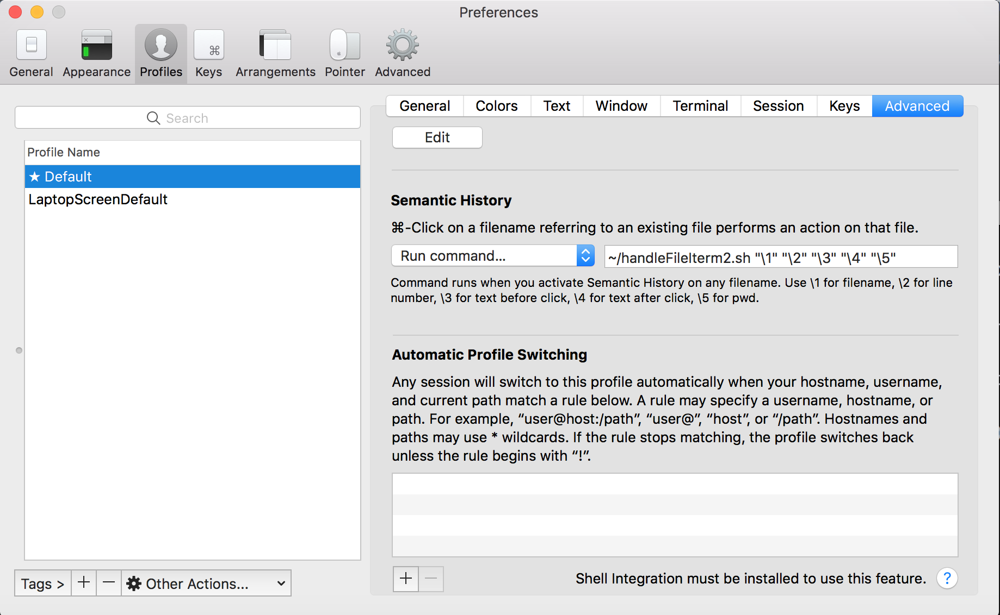

# IntelliJ Idea integration in Iterm2

This script will open a file in IntelliJ when cmd+clicking in Iterm2 on a filename, and jumps to the corresponding lineNumber.
It is useful for when you have compilation errors and want to quickly jump to the error.
When to open IntelliJ can be configured for specific directories in the script, if there is no match it will fall back to opening the file with the default application.

Tested on Mac, with IntelliJ 15.

## Configuring Iterm2

1. Go to Preferences > Profiles and select the profile you want to configure.
2. Go to Advanced and jump to the `Semantic History` section.
3. Select `Run command...` in the dropdown and paste the following line: `./handleFileIterm2.sh "\1" "\2" "\3" "\4" "\5" "debug"`.

## Debugging
By supplying a 6th argument to the handleFileIterm2.sh it will dump some variables to a file called dump.txt in the same directory as the handleFileIterm2.sh script.
